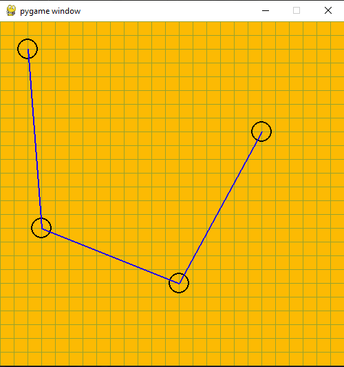

# Python project design

This will be probably used while creating DOOM-like game in C.
It can do only adding and deleting nodes, considering linked list-like structure making sure lines are correct.

# TODO
- [x] Adding points
- [x] Removing points
- [x] Moving existing nodes
- [x] Correct lines
- [ ] There is certain usecase when lines are incorrect
- [ ] Maybe multiple modes (for example. 'adding', 'removing', 'connecting') instead of different mouse clicks
- [ ] Serialization (export to binary?)
- [ ] Saving and loading

# Screens
</img>
